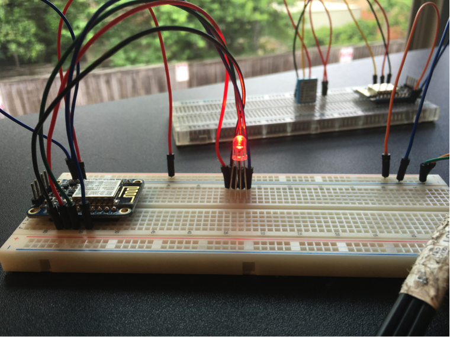

### Overview
The premis for this project was to create a sensor netowrk that could both send and recieve data via Voise XML. I accomplished this using many technologies such as, PHP, XML, Voice XML, XSLT, ESP8266, LEDs, and a temperature sensor. In my sensor network I configured two wifi enabled microcontrollers to run a full TCP/IP stack, where one microcontroller would act as a server (waiting for commands) and the other would act as a client (sending data). The server controlled the color of an RGB LED, which changed based on voice commands sent via Voice XML.The client was pulling temperature data via a [DHT11](https://www.adafruit.com/product/386), temperature/humidity sensor, and sending that to be stored on a public cloud server in an XML file.

The result of this project was the ability to request temperature information within a specific time range and the ability to change the color of the LED light all via voice commands. I made a video and have listed more information about the technologies and code I used below. Note to reader: If I had to go back and do this project all over again, I would never use these XML technologies. Enjoy!

**Pro tip:** If you dont like reading check out my video [XML SensorNet](https://www.youtube.com/edit?o=U&video_id=XvHOK9Ne5KM)

##### Cool photos from the project
ESP8266 Client + Temperature Sensor (LEFT) | ESP8266 Server + LED (RIGHT)



### ESP8266
An ESP8266 is an 80MHz processor that is wifi enabled to run a full TCP/IP network stack. Because this chip is a microporssesor, that eliminates the need to use something else like arduino + a wifi shield, to do simple embeded projects. The easiest way I found to work with this chip was with a breakout board from [adafruit](https://www.adafruit.com/product/2471). The reason I selected this board specifically, is for two reasons,
1. Adafruit has some good documentation and walkthroughs
2. It works with Arduino code, which requires little code to get you hosting your own website on this tiny wifi enabled microcontroller in no time


### XML Technologies
#### XSLT
Voice XML is an interesting technology that combinds the brillient suite of XML technologies into one automated voice of agonizing frustration. If you have ever thrown your phone across the room due to a voice automated customer service agagent than this might not be the technology for you. Now, with that out of my system, I think we can all agree, with the rise of Alexa and Google Home purely getting technology to respond to your voice is very satisfying when it works! So I set off on the Voice XML jouney before I was aware of companies like MessageBird and Twilio.

The XML technologies that I used in this project were XSLT and a Voice XML. XSLT ([Extensible Stylesheet Language Transformations](https://www.w3.org/Style/XSL/WhatIsXSL.html)) is an XML technology that reads from XML documents to style and display another XML document. For example, if I have a bunch of data points in my XML document (a type of data store) and I want to add those points to be displayed to a web browser I could use an XSLT call like the following, `<xsl:value of
select="//dataPoint[@nodeId=1][@nodeType=temp][last()]/tempVal"/>`. What this does is looks for all attributes named `nodeId=1` and out of those values returned it looks for attributes named `nodeType` with a value of `temp`. Lastly, we grab the last value, `last()`. Now, where ever that line is inserted into our XSLT file, we will get a numeric result back. You might be asking why this is useful, well if you have lots of values or data in an XML file, it can be a really nice way to dynamically build XML documents.

This might be a snooze to most peopele so let's move on.

#### Voice XML
In order for Voice XML to work, you need a phone number to call right? RIGHT! There are services out there that enable this and the one I used for this project is called, [Voxeo](https://evolution.voxeo.com/). Frankly, this isn't your cool and cutting edge, API like has a slick interface, but it worked. Essentially for this to work, Voxeo gives you a phone number and you upload an XML file that can be interpreted as Voice XML and you are off to the races. I will warn you, the automatic voice operator will read back full stack crashed with her robotic voice if your code has bugs in it...

### Lets make magic!
#### Architecture Diagram


#### Code by component
##### ESP8266 Client sending temperature data
This code was downloaded and run on the ESP8266 that continuously sent temperature data to be stored on public cloud server (Lyle Server). The XML format that the data was sent in is as follows:
```
<?xml version="1.0" encoding="UTF8"?> 
<sensorData>
	<dataPoint nodeId="1" nodeType= "temp"> 
		<tempVal>66.20</tempVal> 
		<humidVal>4 0.00</humidVal> 
		<date>20160502</date> 
		<time>10:54:03</time>
	</dataPoint> 
</sensorData>
```
```
#include <ESP8266WiFi.h>
#include "DHT.h"

#define DHTTYPE DHT11
#define DHTPIN 2

const char* ssid     = "WuTangLan";
const char* password = "teamtrexel";
const char* host = "lyle.smu.edu";

int nodeId = 1;
String nodeType = "temp";
int value = 0;

DHT dht(DHTPIN, DHTTYPE);

void setup() {
  Serial.begin(115200);
  Serial.println("Starting DHT11 ESP Program...");

  // Initialize DHT module
  dht.begin();
  
  // Initialize WiFi module...Try to connect
  Serial.println();
  Serial.println();
  Serial.print("Connecting to ");
  Serial.println(ssid);
  WiFi.begin(ssid, password);
  
  while (WiFi.status() != WL_CONNECTED) {
    delay(500);
    Serial.print(".");
  }

  Serial.println("");
  Serial.println("WiFi connected");  
  Serial.println("IP address: ");
  Serial.println(WiFi.localIP());

}

// the loop function runs over and over again forever
void loop() {
  ++value;

  float h = dht.readHumidity();
  float f = dht.readTemperature(true); //true = Fahrenheit
  
  // Check if any reads failed and exit early (to try again).
  if (isnan(h) || isnan(f)) {
    Serial.println("Failed to read from DHT sensor!");
    return;
  }
  
  // Compute heat index in Fahrenheit (the default)
  float hif = dht.computeHeatIndex(f, h);

  Serial.print("Humidity: ");
  Serial.print(h);
  Serial.print(" %\t");
  Serial.print("Temperature: ");
  Serial.print(f);
  Serial.print(" *F\t");
  Serial.print("Heat index: ");
  Serial.print(hif);
  Serial.println(" *F");


  Serial.print("connecting to ");
  Serial.println(host);
  
  // Use WiFiClient class to create TCP connections
  WiFiClient client;
  const int httpPort = 80;
  if (!client.connect(host, httpPort)) {
    Serial.println("connection failed");
    return;
  }

  // We now create a URI for the request
  String getParams = "?nodeId=" + String(nodeId) + "&" +
                     "nodeType=" + nodeType + "&" +
                     "temp=" + f +"&" +
                     "humid=" + h;
  String url = " /~zshainsky/7347/SensorNet/sensorNetPost.php" + getParams;
  
  Serial.print("Requesting URL: ");
  Serial.println(url);
  // Serial.println("Sending POST Request: ");
  // Serial.println(post);
  
  // This will send the request to the server
  client.print(String("GET ") + url + " HTTP/1.1\r\n" +
               "Host: " + host + "\r\n" + 
               "Connection: close\r\n\r\n");
  delay(10);
  
  //Read all the lines of the reply from server and print them to Serial
  while(client.available()){
    String line = client.readStringUntil('\r');
    Serial.print(line);
  }
   
  Serial.println();
  Serial.println("closing connection");
  Serial.println("Waiting 15 seconds for next data reading...");
  
  delay(15000);
}
```

##### ESP8266 Server sending temperature data
This code was downloaded and run on the ESP8266 that acted as a server, which continuously waited for commands from the public cloud server (Lyle Server). Commands were sent to change color of the LED based on input from the user.
```
#include <ESP8266WiFi.h>

const char* ssid = "WuTangLan";
const char* password = "teamtrexel";
WiFiServer server(1234);

const int RED_PIN = 15;
const int GREEN_PIN = 2;
const int BLUE_PIN = 4;
int DISPLAY_TIME = 100;

void mainColors()
{
// Off (all LEDs off):

digitalWrite(RED_PIN, LOW);
digitalWrite(GREEN_PIN, LOW);
digitalWrite(BLUE_PIN, LOW);

delay(1000);

// Red (turn just the red LED on):

digitalWrite(RED_PIN, HIGH);
digitalWrite(GREEN_PIN, LOW);
digitalWrite(BLUE_PIN, LOW);

delay(1000);

// Green (turn just the green LED on):

digitalWrite(RED_PIN, LOW);
digitalWrite(GREEN_PIN, HIGH);
digitalWrite(BLUE_PIN, LOW);

delay(1000);

// Blue (turn just the blue LED on):

digitalWrite(RED_PIN, LOW);
digitalWrite(GREEN_PIN, LOW);
digitalWrite(BLUE_PIN, HIGH);

delay(1000);

// Yellow (turn red and green on):

digitalWrite(RED_PIN, HIGH);
digitalWrite(GREEN_PIN, HIGH);
digitalWrite(BLUE_PIN, LOW);

delay(1000);

// Cyan (turn green and blue on):

digitalWrite(RED_PIN, LOW);
digitalWrite(GREEN_PIN, HIGH);
digitalWrite(BLUE_PIN, HIGH);

delay(1000);

// Purple (turn red and blue on):

digitalWrite(RED_PIN, HIGH);
digitalWrite(GREEN_PIN, LOW);
digitalWrite(BLUE_PIN, HIGH);

delay(1000);

// White (turn all the LEDs on):

digitalWrite(RED_PIN, HIGH);
digitalWrite(GREEN_PIN, HIGH);
digitalWrite(BLUE_PIN, HIGH);

delay(1000);
}

void setup() {
  Serial.begin(115200);
  delay(10);

  // prepare GPIO2
  pinMode(RED_PIN, OUTPUT);
  pinMode(GREEN_PIN, OUTPUT);
  pinMode(BLUE_PIN, OUTPUT);
  digitalWrite(RED_PIN, HIGH);
  digitalWrite(GREEN_PIN, HIGH);
  digitalWrite(BLUE_PIN, HIGH);
  
  // Connect to WiFi network
  Serial.println();
  Serial.println();
  Serial.print("Connecting to ");
  Serial.println(ssid);
  
  WiFi.begin(ssid, password);
  
  while (WiFi.status() != WL_CONNECTED) {
    delay(500);
    Serial.print(".");
  }
  Serial.println("");
  Serial.println("WiFi connected");
  
  // Start the server
  server.begin();
  Serial.println("Server started");

  // Print the IP address
  Serial.println(WiFi.localIP());

}

void loop() {
  // Check if a client has connected
  WiFiClient client = server.available();
  if (!client) {
    return;
  }
  // Wait until the client sends some data
  Serial.println("new client");
  while(!client.available()){
    delay(1);
  }
  // Read the first line of the request
  String req = client.readStringUntil('\r');
  Serial.println(req);
  client.flush();
  // Match the request
  int val = 1;
  if (req.indexOf("/led?color=red") != -1) {
    digitalWrite(RED_PIN, 0);
    digitalWrite(GREEN_PIN, 1);
    digitalWrite(BLUE_PIN, 1);
  } else if (req.indexOf("/led?color=green") != -1) {
    digitalWrite(RED_PIN, 1);
    digitalWrite(GREEN_PIN, 0);
    digitalWrite(BLUE_PIN, 1);
  } else if (req.indexOf("/led?color=blue") != -1) {
    digitalWrite(RED_PIN, 1);
    digitalWrite(GREEN_PIN, 1);
    digitalWrite(BLUE_PIN, 0);
  } else {
    Serial.println("invalid request");
    client.stop();
    return;
  }
  
  client.flush();

  // Prepare the response
  String s = String("HTTP/1.1") + " 200 OK\r\nContent-Type: text/xml\r\n\r\n" + 
             "<?xml version=\"1.0\" encoding=\"UTF-8\"?>\r\n" +
             "<vxml version=\"2.1\">" +
             "<form id=\"getRequest\"><block><prompt></prompt> <goto next=\"http://lyle.smu.edu/~zshainsky/7347/SensorNet/sensorNetVoice.xml#getRequest\" />\"</block></form>" +
             "</vxml>";

  // Send the response to the client
  client.print(s);
  delay(1);
  Serial.println("Client disonnected");

  // The client will actually be disconnected 
  // when the function returns and 'client' object is detroyed

}
```

##### PHP Code that was running on the public cloud server to handle writting temerature data to disk
All this code does, is writes data to a file. Simple enough right?
```
<?php
function logTemperature($xmlDoc, $dateFormat, $timeFormat) {
	// Get <sensorData> dom elements
	$sensorData = $xmlDoc -> getElementsByTagName("sensorData")->item(0);

	// Create Attributes for our <dataPoint> element
	$nodeId = $xmlDoc -> createAttribute("nodeId");
	$nodeId -> value = $_GET["nodeId"];
	$nodeType = $xmlDoc -> createAttribute("nodeType");
	$nodeType -> value =  $_GET["nodeType"];

	// Create Elements for our <dataPoint> element
	$temp = $xmlDoc -> createElement("tempVal", $_GET["temp"]);
	$humid = $xmlDoc -> createElement("humidVal", $_GET["humid"]);
	$date = $xmlDoc -> createElement("date", date($dateFormat));
	$time = $xmlDoc -> createElement("time", date($timeFormat));
	$dataPoint = $xmlDoc -> createElement("dataPoint");

	// Append all Attributes and Elements for our <dataPoint> element
	$dataPoint -> appendChild($nodeId);
	$dataPoint -> appendChild($nodeType);
	$dataPoint -> appendChild($temp);
	$dataPoint -> appendChild($humid);
	$dataPoint -> appendChild($date);
	$dataPoint -> appendChild($time);
	$sensorData -> appendChild($dataPoint);

	// Return updated XML DOM Document
	return $xmlDoc;

}

$fileName = "sensorNetData.xml";
$dateFormat = "Ymd";
$timeFormat = "h:i:s";

// Open file and ensure that we are the only one with access at this time else wait
$file = fopen($fileName, "r+");
if(flock($file, LOCK_EX)) {

	$curXMLDoc = new DOMDocument();
	$curXMLDoc -> load($fileName);
	$updatedXMLDoc = $curXMLDoc;

	if($_GET["nodeType"] == "temp") {
		$updatedXMLDoc = logTemperature($curXMLDoc, $dateFormat, $timeFormat);
	}

	$updatedXMLDoc -> save($fileName);
	print $updatedXMLDoc -> saveXML();

	fclose($file);
} else {
    echo "Couldn't get the lock for ".$fileName;
}
?>
```
##### PHP Code that handled LED color changes
This code handled all inbound requests from the Voice XML server. It takes the color that the user wants to change the LED to, and sends out the request to the ESP8266 server to change the color of the LED
```
<?php
	$timeStampFormat = "Y-m-d h:i:s";
	$val = "";
	$tempDetail = "";
	if(isset($_REQUEST['nodeType'])) {
		$val = $_REQUEST['nodeType'];
	}
	$xp = new XsltProcessor();
	$xsl = new DomDocument;
	$xsl->load('sensorNetQuery.xsl');
	$xp -> importStylesheet($xsl);
	$xml_doc = new DomDocument;
	$xml_doc -> load('sensorNetData.xml');
	$xp -> setParameter(NULL, 'nodeType', $val);
	if(isset($_REQUEST['tempDetail'])) {
		$xp -> setParameter(NULL, 'tempDetail', $_REQUEST['tempDetail']);
		$xp -> setParameter(NULL, 'date', date($timeStampFormat));
	}
	if(isset($_REQUEST['startDate'])) {
		$xp -> setParameter(NULL, 'startDate', $_REQUEST['startDate']);
	}
	if(isset($_REQUEST['endDate'])) {
		$xp -> setParameter(NULL, 'endDate', $_REQUEST['endDate']);
	}
	if($html = $xp -> transformToXML($xml_doc)) {
		echo $html;
	} else {
		echo "-- could not transform --";
		trigger_error('XSL transformation failed.', E_USER_ERROR);
	}
?>
```

##### Voice XML Code using XSLT to create the dynamic Voice XML document
This code runs on the Voice XML server. The XML code uses XSLT to dynamically load values for the automated voice to say to the user. When the user responds to one of the options and gives a command, the script submits a request to the public cloud server to call the proper PHP script above.
```
<?xml version="1.0" encoding="UTF-8"?>
<!DOCTYPE vxml SYSTEM "http://www.w3.org/TR/voicexml20/vxml.dtd">
<vxml version = "2.1" xmlns="http://www.w3.org/2001/vxml" xmlns:xsi="http://www.w3.org/2001/XMLSchema-instance" xsi:schemaLocation="http://www.w3.org/2001/vxml http://www.w3.org/TR/voicexml20/vxml.xsd">
	<var name="nodeType"/>
	<var name="tempDetail"/>
	<var name="startDate"/>
	<var name="endDate"/>
	<form id="getRequest">
		<block>
    			Welcome to your X M L butler.
    	</block>
		<field name="nodeTypeSelect">
			<prompt>
				Please select from the following options.
				<enumerate>
				</enumerate>
			</prompt>
			<option dtmf="1" value="temp">Temperature</option>
			<option dtmf="2" value="led">Lights</option>
			<filled>
				<assign name="nodeType" expr="nodeTypeSelect" />
				<if cond="nodeTypeSelect == 'temp'">
					<goto next="#tempDetailSelect"/>

					<!-- <submit next="http://lyle.smu.edu/~zshainsky/7347/SensorNet/sensorNetQuery.php" Method="GET" namelist="nodeType"/> -->
				<elseif cond="nodeTypeSelect == 'led'"/>
				</if>
			</filled>
		</field>
		<field name="color">
			<prompt> What color would you like to see? </prompt>
			<grammar xml:lang="en-US" version="1.0" root="colorGrammar">
				<rule id="colorGrammar" scope="public">
					<one-of>
						<item><tag>'red'</tag>red</item>
						<item><tag>'green'</tag>green</item>
						<item><tag>'blue'</tag>blue</item>
						<item><tag>'red'</tag>burgundy</item>
						<item><tag>'blue'</tag>indigo</item>
						<item><tag>'green'</tag>teal</item>
					</one-of>
				</rule>
			</grammar>
			<filled>
				<prompt>
					Turning on your lights.
				</prompt>
				<submit next="http://172.5.172.128:1234/led" Method="GET" namelist="color"/>
			</filled>
		</field>
	</form>
	<form id="tempDetailSelect">
		<field name="detail">
			<prompt>What temperature statistics are you interested in?
			<enumerate>
			</enumerate>
			</prompt>
			<option dtmf="1" value="curTemp">Current Temperature. </option>
			<option dtmf="2" value="tempByDate"> Temperature by date range. </option>
			<filled>
				<assign name="tempDetail" expr="detail" />
				<if cond="detail == 'curTemp'">
					<goto next="#sensorQuery"/>
				<elseif cond="detail == 'tempByDate'"/>
					<goto next="#tempByDateSelect"/> 
				</if>
			</filled>
		</field>
	</form>
	<form id="tempByDateSelect">
		<field name="startDateSelect" type="date">
			<prompt> Please specify a start date. </prompt>
			<filled>
				<assign name="startDate" expr="startDateSelect" />
			</filled>
		</field>
		<field name="endDateSelect" type="date">
			<prompt> Please specify an end date. </prompt>
			<filled>
				<assign name="endDate" expr="endDateSelect" />
				<goto next="#sensorQuery"/>
			</filled>
		</field>
	</form>
	<form id="sensorQuery">
		<block>
			<submit next="http://lyle.smu.edu/~zshainsky/7347/SensorNet/sensorNetQuery.php" Method="GET" namelist="nodeType tempDetail startDate endDate"/>
		</block>
	</form>
</vxml>
```
##### XSLT Code to query temperature data and return result
This code is XSLT at its finest. It uses XSLT to query through the XML file filled with data points and returns the requested values for the automated voice to output to the user.
```
<?xml version="1.0" encoding="UTF-8"?>
<!DOCTYPE vxml SYSTEM "http://www.w3.org/TR/voicexml20/vxml.dtd">
<xsl:stylesheet xmlns:xsl="http://www.w3.org/1999/XSL/Transform" version="1.0">
<xsl:output method="xml" doctype-system="http://www.w3.org/TR/Voice XML20/vxml.dtd"/>
<xsl:template match="/">
<vxml version = "2.1" xmlns="http://www.w3.org/2001/vxml" xmlns:xsi="http://www.w3.org/2001/XMLSchema-instance" xsi:schemaLocation="http://www.w3.org/2001/vxml http://www.w3.org/TR/voicexml20/vxml.xsd">
<form id="getRequest">
    <block>
		<prompt>
			<xsl:choose>
				<xsl:when test="$nodeType = 'temp'">
					<xsl:choose>
						<xsl:when test="$tempDetail = 'curTemp'">
							The current temperature is:
							<say-as interpret-as="vxml:digits"> 
								<xsl:value-of select="//dataPoint[@nodeId = 1][@nodeType = $nodeType][last()]/tempVal"/>
							</say-as>
							degrees fahrenheit with 
							<say-as interpret-as="vxml:digits"> 
								<xsl:value-of select="//dataPoint[@nodeId = 1][@nodeType = $nodeType][last()]/humidVal"/>
							</say-as>
							percent humidity.
							Enjoy your day.
						</xsl:when>
						<xsl:when test="$tempDetail = 'tempByDate'">
							The average temperature between 
							<say-as interpret-as="vxml:date"><xsl:value-of select="$startDate"/></say-as>
							and
							<say-as interpret-as="vxml:date"><xsl:value-of select="$endDate"/></say-as>
							was
							<xsl:variable name="avgTempList" select="//dataPoint[@nodeId = 1][@nodeType = 'temp'][date &gt; $startDate][date &lt; $endDate]/tempVal" /> 
							<say-as interpret-as="vxml:digits"> 
								<xsl:value-of select="sum($avgTempList) div count($avgTempList)"/>
							</say-as>
							, and the average humidity percentage was 
							<xsl:variable name="avgHumidList" select="//dataPoint[@nodeId = 1][@nodeType = 'temp'][date &gt; $startDate][date &lt; $endDate]/humidVal" />
							<say-as interpret-as="vxml:digits"> 
								<xsl:value-of select="sum($avgHumidList) div count($avgHumidList)"/>.
							</say-as>
						</xsl:when>
					</xsl:choose>
				</xsl:when>
				<xsl:when test="$nodeType = 'led'"></xsl:when>
			</xsl:choose>
		</prompt>
		<goto next="sensorNetVoice.xml#getRequest" />
	</block>
</form>
</vxml>
</xsl:template>
</xsl:stylesheet>
```

